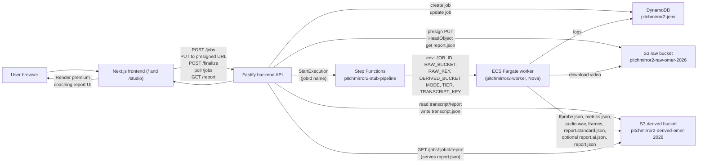

## Architecture

This document describes the end‑to‑end architecture of **PitchMirror**: how the frontend, backend, AWS infrastructure, and Amazon Nova work together to turn a practice pitch video into a structured coaching report.

---

### High‑level system diagram

---

### Core components

- **Frontend (Next.js app)**
  - Landing page at `/` explains the product and funnels users into the studio.
  - Studio page at `/studio` orchestrates:
    - Mode selection: Audio coaching, Camera coaching, Full pitch review.
    - Single video upload per job.
    - Optional transcript entry.
    - Analysis start, status polling, and report rendering.
  - Communicates with the backend via the documented HTTP API.

- **Backend API (Fastify + TypeScript)**
  - Owns the **job lifecycle** and API endpoints:
    - `POST /jobs`
    - `POST /jobs/:jobId/finalize`
    - `GET /jobs/:jobId`
    - `GET /jobs/:jobId/report`
    - `POST /jobs/:jobId/transcript`
    - `GET /health`
  - Persists job state in DynamoDB (`pitchmirror2-jobs`).
  - Issues presigned S3 upload URLs for the raw bucket.
  - Starts the Step Functions state machine to kick off the worker.
  - Serves the final canonical `report.json` from the derived bucket once a job has succeeded.

- **AWS data plane**
  - **Region**: `us-east-1`.
  - **Raw bucket** (`RAW_BUCKET`): `pitchmirror2-raw-omer-2026`.
    - Stores user‑uploaded pitch videos under `raw/<JOB_ID>/input.<ext>`.
  - **Derived bucket** (`DERIVED_BUCKET`): `pitchmirror2-derived-omer-2026`.
    - Stores all derived artifacts under `derived/<JOB_ID>/...`:
      - `ffprobe.json`, `metrics.json`, `audio.wav` (when applicable), frame images.
      - `report.standard.json` (deterministic baseline).
      - `report.ai.json` (AI‑generated report, when Nova succeeds).
      - `report.json` (canonical final report served to clients).
      - `transcript.json` and `subtitles.vtt` when BYOT transcript is uploaded.
  - **DynamoDB table** (`JOBS_TABLE`): `pitchmirror2-jobs`.
    - Stores `JobRecord` items keyed by `jobId`.
    - Tracks status, stage, mode, tier, upload metadata, report key, transcript key, and error information.

- **Orchestration and compute**
  - **Step Functions state machine** (`PITCHMIRROR_SFN_ARN`):
    - ARN: `arn:aws:states:us-east-1:127214190437:stateMachine:pitchmirror2-stub-pipeline`.
    - Backend calls `StartExecution` with `name = jobId` and an input payload including:
      - `jobId`, `rawBucket`, `rawKey`, `derivedBucket`, `reportKey`, `mode`, `tier`, `transcriptKey`, `subtitlesKey`.
    - The state machine ultimately runs the ECS worker task with the appropriate environment.
  - **ECS cluster**: `pitchmirror2`.
  - **ECR repo**: `pitchmirror2-worker`.
  - **CloudWatch log group**: `/ecs/pitchmirror2-worker`.

- **Worker (ECS Fargate, Python)**
  - Entrypoint: `worker/main.py`.
  - Responsibilities:
    - Validate required environment (`JOB_ID`, `RAW_BUCKET`, `RAW_KEY`, `DERIVED_BUCKET`, `MODE`, `TIER`).
    - Download the raw video from S3 (streaming) to `/tmp/input.mp4`.
    - Run `ffprobe` and write `ffprobe.json`.
    - Parse duration, FPS, resolution, and presence of audio.
    - Enforce per‑tier duration caps.
    - Extract mono 16 kHz WAV audio (for `voice` and `full` modes) and compute RMS.
    - Extract a small set of representative keyframes (for `presence` and `full` modes) and upload them.
    - Compute and upload `metrics.json`.
    - Build a deterministic **heuristic** report and validate it.
    - When configured with a Bedrock model ID, call Amazon Nova to generate or refine the report.
    - Write:
      - `report.standard.json` – always.
      - `report.ai.json` – only when AI succeeds and passes validation.
      - `report.json` – canonical final report used by the backend.

---

### Modes and tiers

- **Modes** (backend and worker agree on these):
  - `voice` (Audio coaching)
  - `presence` (Camera coaching)
  - `full` (Full pitch review)

  The worker uses mode to decide which artifacts to produce:

  - `voice`:
    - Extracts audio.
    - Does not rely on frames for Nova.
  - `presence`:
    - Extracts keyframes.
    - Does not attempt audio‑based heuristics beyond basic metadata.
  - `full`:
    - Combines both audio and frames, depending on whether a transcript is available.

- **Tiers**:
  - `free`, `pro`, `max` – defined in the backend and worker with max size/duration limits.
  - Each tier has:
    - **Backend**: maximum upload size (`TIER_MAX_BYTES`).
    - **Worker**: maximum duration (`DURATION_CAPS_SECONDS`).

---

### Deterministic baseline vs. AI enhancement

The system is designed so that every successful pipeline run yields a **deterministic baseline report**, regardless of whether Nova is available or succeeds.

1. **Baseline (heuristic) report**
   - Built in the worker based on:
     - Media duration, resolution, FPS.
     - Presence/absence of audio and RMS level.
     - Number of frames extracted.
   - Produces:
     - `overall` score and summary.
     - `top_fixes` with at least three items.
     - `voice`, `presence`, `content` sections.
     - A small `practice_plan` and `limitations`.
     - `artifacts.raw` and `artifacts.report` pointing to the correct S3 locations.
   - Stored as `report.standard.json` and uploaded to the derived bucket.

2. **Nova call (optional)**
   - Configured via `BEDROCK_MODEL_ID` (e.g. `amazon.nova-pro-v1:0`).
   - The worker decides whether and how to call Nova based on:
     - `MODE` (`voice`, `presence`, `full`).
     - Whether a transcript is available.
     - Whether representative frames are available.
   - Evidence sent to Nova:
     - `metrics.json` contents (text).
     - Transcript text (when present and within character limits).
     - Up to a small number of JPEG keyframes.

3. **AI output validation and normalization**
   - Nova is instructed to return **JSON only** matching the backend’s `ReportSchema`.
   - The worker:
     - Attempts to parse the JSON.
     - Backfills missing sections from the heuristic report.
     - Normalizes or repairs scores to fit `0–100` bounds.
     - Validates via the same schema used in the backend.
   - On success:
     - Writes `report.ai.json`.
     - Sets `analysis_mode`, `ai_used`, and `transcript_used` appropriately.
   - On failure (including repair attempts):
     - Falls back to the deterministic baseline (`standard` mode, `ai_used = false`).

4. **Final `report.json`**
   - The worker always writes a canonical `report.json` that:
     - Passes the backend schema validation.
     - Includes:
       - `analysis_mode`: `"standard"`, `"ai"`, or `"hybrid"`.
       - `ai_used`: boolean.
       - `transcript_used`: boolean.
     - Ensures `artifacts.raw` and `artifacts.report` are correctly set.

---

### Transcript‑aware flow

- **Transcript upload**
  - Backend route: `POST /jobs/:jobId/transcript`.
  - Stores:
    - `derived/<JOB_ID>/transcript.json` (JSON containing `text` and metadata).
    - `derived/<JOB_ID>/subtitles.vtt` when provided.
  - Updates the job record to include `transcriptKey` and optional `subtitlesKey`.

- **Worker behavior**
  - When `TRANSCRIPT_KEY` is set, the worker:
    - Fetches and parses the transcript JSON from the **derived bucket**.
    - Extracts `text` and passes it to Nova when configured to do so.
  - Modes:
    - `voice`:
      - Uses the transcript only when present; otherwise, Nova is skipped for content‑level analysis.
    - `presence`:
      - Primarily uses frames; transcript is optional and may still inform content nuances but is not required.
    - `full`:
      - With transcript:
        - Uses both transcript and frames for Nova.
      - Without transcript:
        - May run Nova with frames only and optionally hybrid‑merge AI presence into the deterministic report.

---

### Fallback behavior

At every stage, the system favors **valid, deterministic output** over failing the job:

- If Step Functions execution fails to start:
  - The backend marks the job as `FAILED` with error metadata.
- If the worker encounters:
  - Missing configuration or bucket/keys:
    - It logs a `worker_error` and exits non‑zero; the job remains failed and the frontend surfaces the failure.
  - Nova errors (network, model issues, invalid JSON):
    - It logs the error and falls back to the deterministic `standard` report, still writing `report.json`.
- The frontend:
  - Treats `SUCCEEDED` jobs with a valid report as the happy path.
  - Surfaces job failures and pipeline errors to the user in the studio UI.

---

### Verified working flows

The architecture and implementation support (and have been manually verified for) at least the following flows:

- **Presence AI flow**
  - Mode: `presence`.
  - Upload video only (no transcript).
  - Worker extracts keyframes, calls Nova with frames + metrics, and produces:
    - `report.standard.json`.
    - `report.ai.json` with presence‑focused feedback.
    - `report.json` reflecting `analysis_mode = "ai"` or `"hybrid"` as configured.

- **Voice + transcript AI flow**
  - Mode: `voice`.
  - Upload video and provide transcript via `POST /jobs/:jobId/transcript`.
  - Worker:
    - Extracts audio.
    - Fetches transcript text.
    - Calls Nova with metrics + transcript.
    - Produces:
      - `report.standard.json`.
      - `report.ai.json` (Nova‑generated voice and content feedback).
      - `report.json` with `analysis_mode = "ai"`, `ai_used = true`, `transcript_used = true`.

For route‑level and type‑level details, see `backend.md` and `api.md`. For instructions on how to exercise these flows end‑to‑end, see `testing.md` and `SMOKE_TEST.md`.

